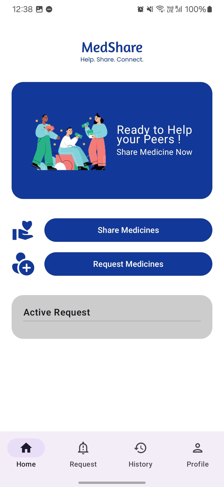
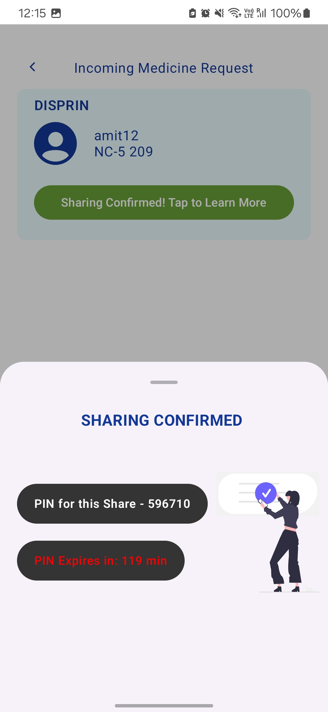
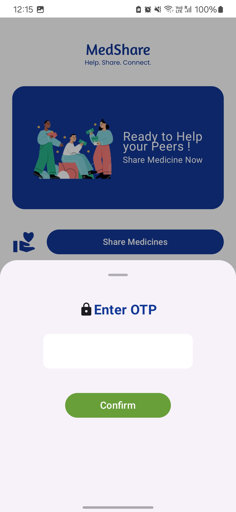

# MedShare💊🤝
MedShare is a peer-to-peer emergency medicine sharing platform designed for residents of hostels and apartments. The app enables users to quickly find and request essential medicines from nearby peers when pharmacies are closed or inaccessible. Built with a focus on community support, speed, and reliability. 

## 💻 Tech Stack
- **Frontend**: Kotlin + Jetpack Compose  
- **Backend**: Java + Spring Boot  
- **Database**: MongoDB  
- **Cloud Hosting**: AWS

## ✨ Features
- Request and share emergency medicines with nearby peers
- Real-time request tracking and response system
- Authentication for verified users
- Location-aware matching
- Push notifications for critical requests
- Clean, intuitive UI optimized for speed

## 💊Architechture Diagram 

  

## 📱 MedShare App Screens
### 🔐 Authentication Screens (Common)

| Splash | Sign Up | Registration | Login |
|--------|---------|--------------|-------|
|  |  |  |  |

### 🤝 Receiver Flow

| Homepage (Initial) | Search Medicines 1 | Search Medicines 2 | Sharing Confirmed by Sender |
|---------------------|--------------------|--------------------|----------------------------|
|  |  |  |  |

| OTP Receiver | P2P Sharing Complete |
|--------------|----------------------|
|  |  |

### 👤 Sharer Flow

| Homepage (Initial) | Incoming Request | Sharing Confirmed (Sender) |
|---------------------|------------------|----------------------------|
|  |  |  |

| OTP Sender | P2P Sharing Complete |
|------------|----------------------|
|  |  |

### 📑 Other Screens

| Share Medicine | History Page | 
|----------------|--------------|
|  |  |

## 💊User Design Flow 
Pending...
